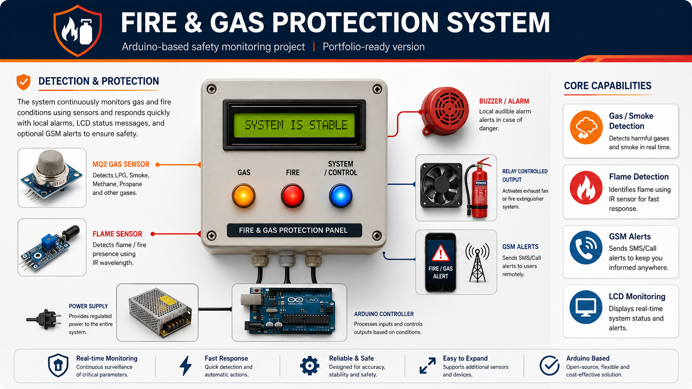
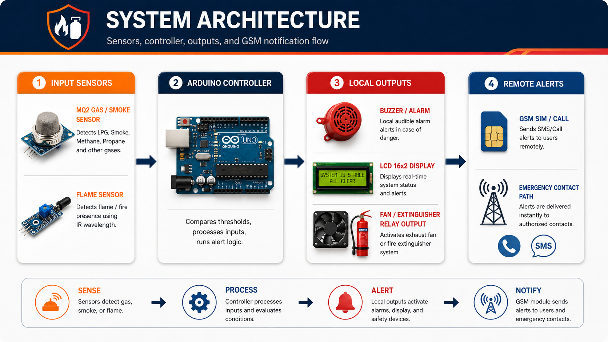
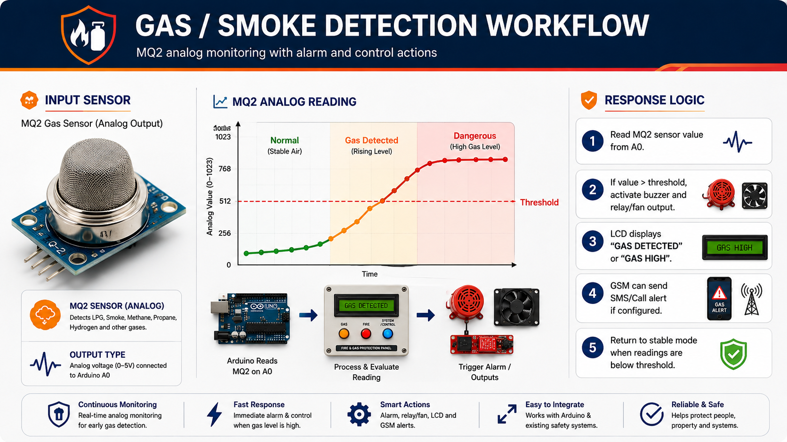
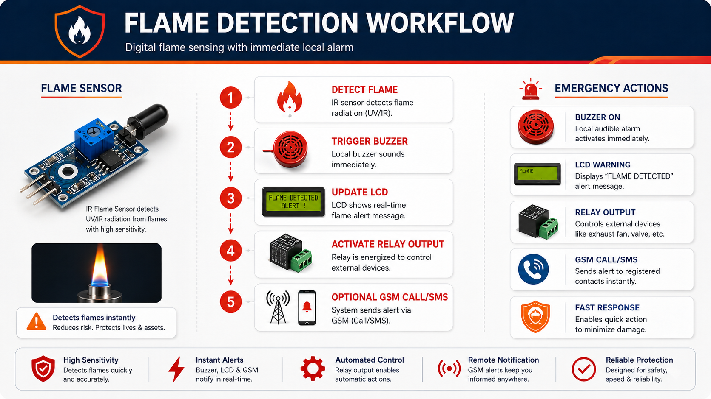
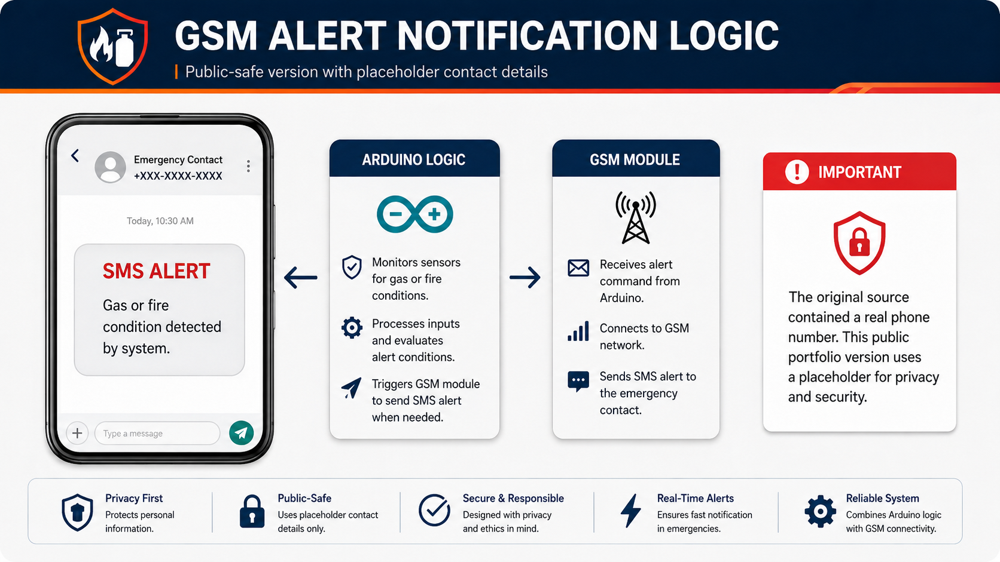
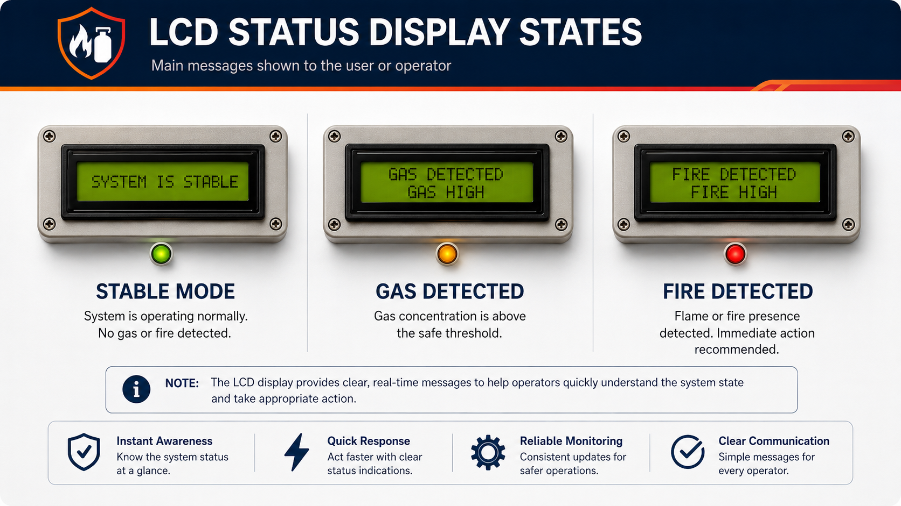
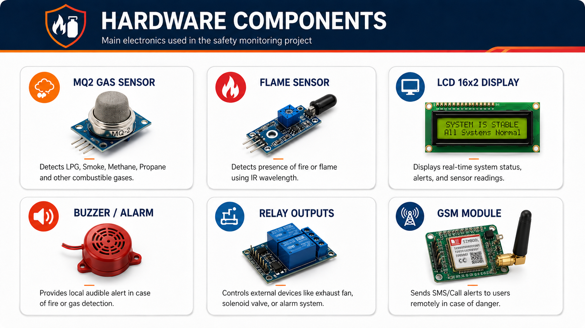
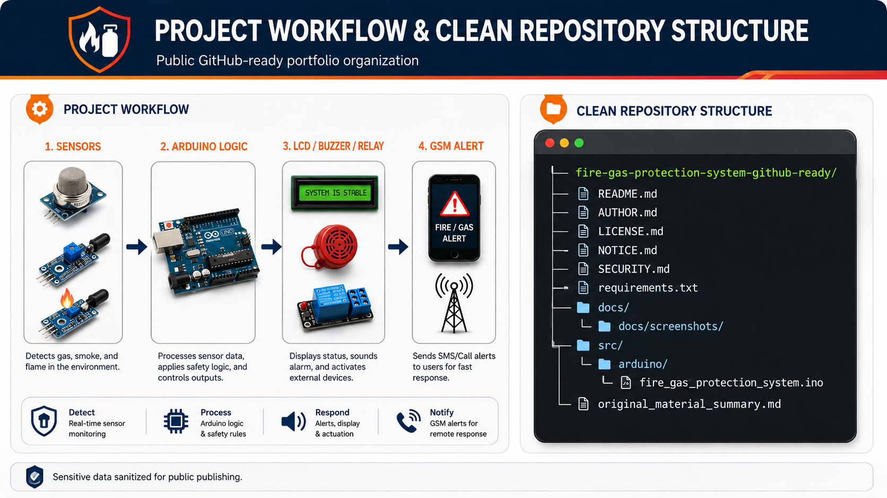

# Fire & Gas Protection System



## Overview
This repository presents a **clean GitHub-ready portfolio version** of an Arduino-based **Fire & Gas Protection System**.

The system monitors dangerous gas/smoke levels and flame conditions, then activates local warning outputs such as buzzer, LCD messages, fan/extinguisher control pins, and GSM notification logic.

## Important Note About This Public Version
The uploaded material contained an Arduino code snippet inside an `.rtf` file. It also included a real phone number used for GSM calling/SMS alerting.

For public GitHub publishing, the private number was removed and replaced with a placeholder:

```text
+XXX-XXXX-XXXX
```

Do not publish real phone numbers or private emergency contacts in GitHub repositories.

## My Contribution
**Prepared, cleaned, documented, and organized by Hassan Abdulsalam Mohammed.**

My work for this portfolio version includes:
- code extraction from RTF format
- code cleanup and restructuring
- replacement of sensitive phone number with placeholder
- README and documentation preparation
- visual project screenshots and diagrams
- GitHub-ready repository organization

## Main Features
- MQ2 gas/smoke detection
- Flame sensor detection
- LCD 16x2 I2C status display
- Buzzer alert output
- Fan / extinguisher control output pins
- GSM SMS / call alert logic
- Stable, gas alert, and fire alert states

## Hardware Components
- Arduino or compatible microcontroller
- MQ2 gas/smoke sensor
- Flame sensor
- 16x2 LCD with I2C module
- GSM module
- Buzzer
- Relay module / fan / extinguisher output
- Jumper wires and power supply

## Screenshots & Visual Explanation
These portfolio visuals were redesigned to be more realistic, clearer, and easier to understand for GitHub presentation. They do not contain university identity, private numbers, or sensitive data.

### Project Banner


### System Architecture


### Gas / Smoke Detection Workflow


### Flame Detection Workflow


### GSM Notification Logic


### LCD Status Display


### Hardware Components


### Clean Repository Structure


## Repository Structure
```text
fire-gas-protection-system-github-ready/
├── README.md
├── AUTHOR.md
├── LICENSE.md
├── NOTICE.md
├── SECURITY.md
├── docs/
├── assets/
└── src/
    └── arduino/
        └── fire_gas_protection_system.ino
```

## How to Use
1. Open `src/arduino/fire_gas_protection_system.ino` in Arduino IDE.
2. Install required libraries:
   - `LiquidCrystal_I2C`
   - `SoftwareSerial` usually included with Arduino AVR boards
3. Replace the placeholder number locally:

```cpp
const char emergencyNumber[] = "+XXX-XXXX-XXXX";
```

4. Upload the sketch to the Arduino board.
5. Test sensors in a safe environment.

## Safety Disclaimer
This repository is a portfolio and educational project. Real fire/gas safety systems require professional-grade sensors, certified hardware, safety testing, fail-safe design, and compliance with local regulations.

---

**Prepared by Hassan Abdulsalam Mohammed**
